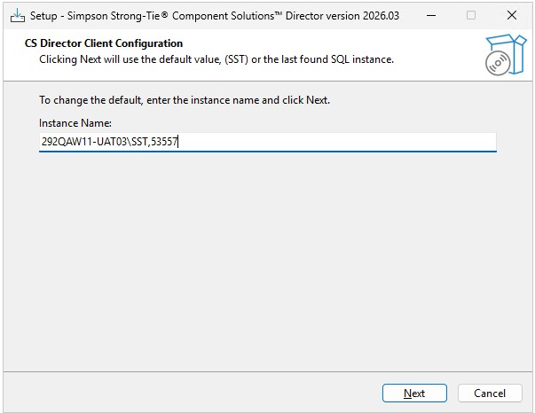
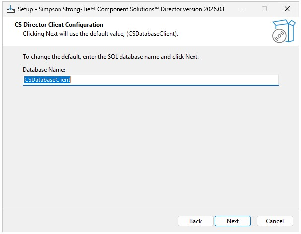
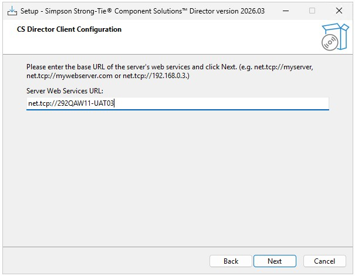
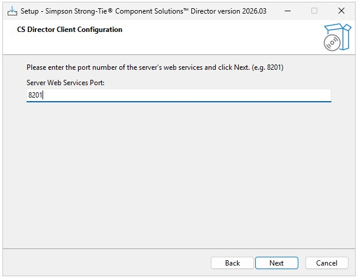
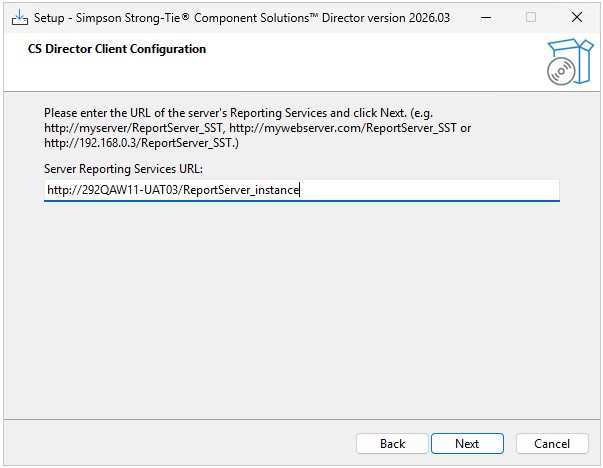
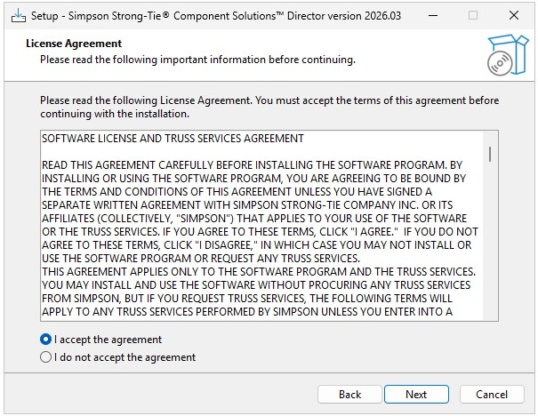
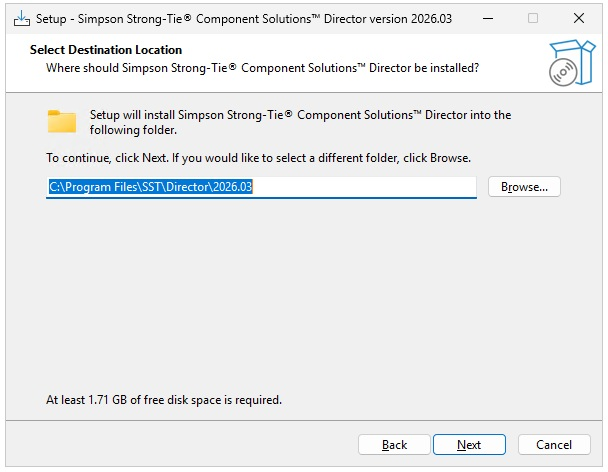
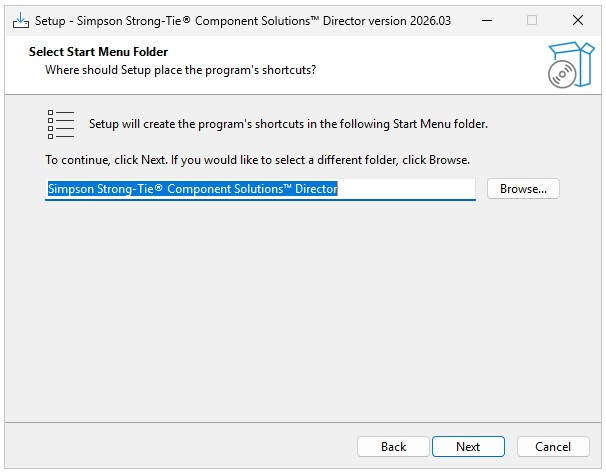
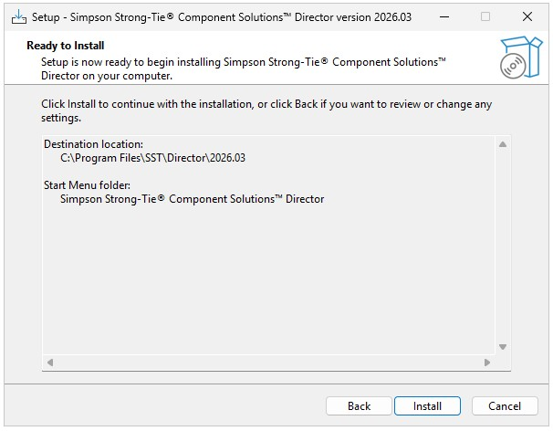
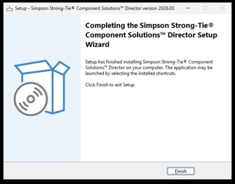

# CSDirector **Client** Installation 
Virtualization Environment

---
### Overview

This guide explains how to install the CSDirector **Client** in a virtualized VMware environment its dependencies, and connect it to an existing CSDirector Server.

### Prerequisites
Ensure the following prerequisites are met:

#### CSDirector Server 
- Is installed and you know the **name** or **IP address** of the machine.
- Must be fully configured before proceeding with client installation. 
  - Please ensure that you can reach the server using the **Terminal** App and **Test-NetConnection**. 
  - Test connecting to the **SQL Server listening port** and **Server Web services port**.

#### SQL Server Connection Information
You will need:
- Server name and SQL instance name (example: **SST**)
- SQL Server listening port (example: **5XXXXX**)
- Database name (example: **CDatabaseServer**)

#### Server Web Services Information
You will need:
- Server web services URL (example: **net.tcp://OUR-SERVER-NAME**)
- Server web services port (example: **8201**)
- Server Reporting Services URL (example: **http://OUR-SERVER-NAME/ReportServer_instance**)

#### Recommended Software
- [.NET 8 Runtime](https://dotnet.microsoft.com/en-us/download/dotnet/8.0)

---
## IMPORTANT
> The Server installer should only be run on the **Server VM**. The Client installer should only be run on **Client VMs**.

---
### Installation

#### Install the CSDirector Client
---
##### Start the Installer
- Download **CSDirectorInstallerClient_XXXXXXXX.exe**
- Double-click the file to start the installer.
- When prompted by User Account Control, click **Yes**.

---
##### Configure the SQL Server connection

In the **Instance Name** field, , enter the fully qualified SQL Server instance name and port and then click on **Next** to continue.

**Example:**
> **OUR-SERVER-NAME\SST,5XXXXX**

_**Note:** Use the server name and listening port identified during the server installation._

---
##### Configure the database

In **Database Name** field, accept the default or enter a database name followed by clicking on **Next** to continue.

**Example:**
> **CSDatabaseClient_MMCFLY**

_**Note:** The installer creates the required databases automatically. **THIS MUST BE UNIQUE PER USER**._

---
##### Configure server web services

1. Enter the server web services base URL and click *Next* to continue.

**Example:**
> **net.tcp://OUR-SERVER-NAME**

2. Enter the web services port and click **Next** to continue.

**Example:**
> **8201**

---
##### Configure Reporting Services

Enter the Reporting Services URL and click **Next** to continue.

**Example:**
> **http://OUR-SERVER-NAME/ReportServer_SST**

_**IMPORTANT:** You will be asked for a **server** and **local** address in the current install. **USE THE SAME URL FOR BOTH**._

---
##### Accept the license agreement

Review the license agreement, select I accept the agreement, and click **Next** to continue.

---
##### Choose installation options

Accept the default installation folder or select a different location and click **Next** to continue

Accept the default Start menu folder and click **Next** to continue

Accept the default Start menu folder and click **Install** to continue

---
##### Complete installation

When installation finishes, click **Finish**

The installer automatically:
- Installed required supporting components
- Created databases and services
- Deployed reports

