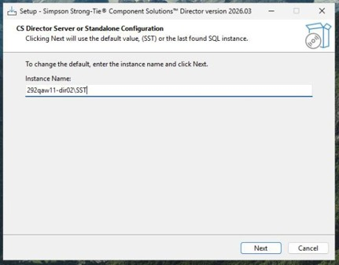
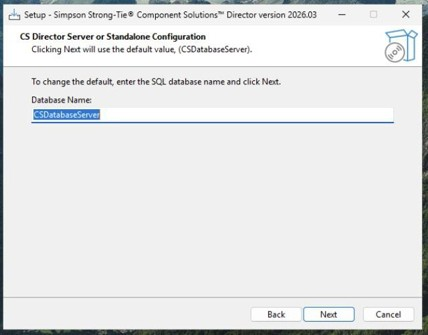
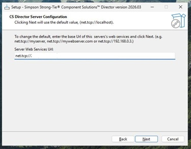
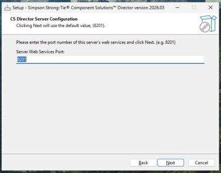
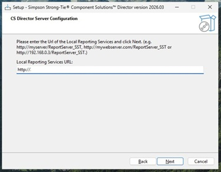
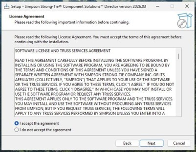
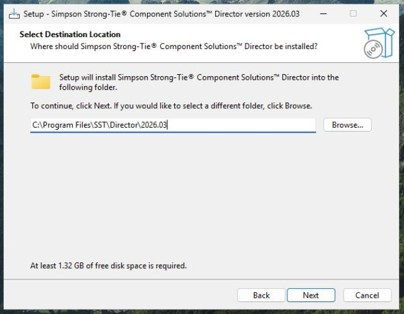
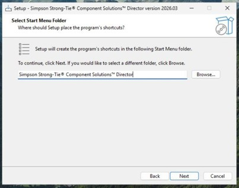
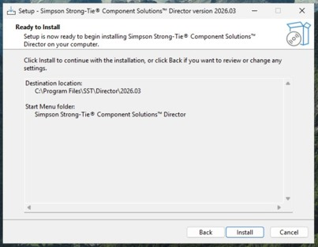

# CSDirector **Server** Installation 
Virtualization Environment

---
### Overview

This guide explains how to install the CSDirector Server in a virtualized VMware environment, its dependencies, and prepare it for client connections.

### Prerequisites
Ensure the following software is installed on the server:

#### Required Software
- [Microsoft SQL Server 2022 (64-bit)](https://www.microsoft.com/en-us/evalcenter/download-sql-server-2022) - _Please note that the instance name is usually setup as **SST**_
- [SQL Server Reporting Services (SSRS) 2022](https://www.microsoft.com/en-us/download/details.aspx?id=104502)

#### Recommended Software
- [.NET 8 Runtime](https://dotnet.microsoft.com/en-us/download/dotnet/8.0)

---
### Installation

#### Install the CSDirector Server
---
##### Start the Installer
- Download **CSDirectorInstallerServer_XXXXXXXX.exe**
- Double-click the file to start the installer.
- When prompted by User Account Control, click **Yes**.
---
##### Configure the SQL Server connection

In the **Instance Name** field, enter the fully qualified SQL Server instance name and then click on **Next** to continue.

**Example:**
> **localhost\SST**

---
##### Configure the database

In **Database Name** field, accept the default or enter a database name followed by clicking on **Next** to continue.

**Example:**
> **CSDatabaseServer**

_**Note:** The installer creates the required databases automatically._

---
##### Configure Server Web Services

1. Enter the server web services base URL and click *Next* to continue.

**Example:**
> **net.tcp://localhost**

2. Enter the web services port and click **Next** to continue.

**Example:**
> **8201**

---
##### Configure Reporting Services

Enter the Reporting Services URL and click **Next** to continue.

**Example:**
> **http://localhost/ReportServer_instance**

---
##### Accept the license agreement

Review the license agreement, select I accept the agreement, and click **Next** to continue.

---
##### Choose installation options

Accept the default installation folder or select a different location and click **Next** to continue

Accept the default Start menu folder and click **Next** to continue

Accept the default Start menu folder and click **Install** to continue

---
##### Complete installation

When installation finishes, click **Finish**

The installer automatically:
- Installed required supporting components
- Created databases and services
- Deployed reports

---
### Preparing for Client Connections
Before installing client components, allow inbound SQL traffic to the server. You’ll need to retrieve the listening port for SQL and create a firewall rule allowing access to that port. We’ve created a script that will make it easier for you to do this. 

1. Copy [Create_SST_Detected_Port_Firewall_Rule.ps1](./files/Create_SST_Detected_Port_Firewall_Rule.ps1) to your Downloads directory.
2. Type **Terminal** in the Taskbar’s **Search**
3. Right click on **Terminal** and click on **Run as Administrator**
4. When prompted by User Account Control, select **Yes**.
5. Change the directory by running the following command:
    `cd Downloads`
6. If scripts are blocked by your system, run the following command in the **Terminal**:
`Set-ExecutionPolicy -Scope Process -ExecutionPolicy Bypass`
7. Then, run the script by copying and pasting the following command in the **Terminal**:
`.\Create_SST_Detected_Port_Firewall_Rule.ps1`
8. Finally, copy the value found after **TCP port(s):** and save it for use when installing the Client. This will be the **SQL Server listening port**. 

---
#### Next Steps
After completing these steps, proceed with the CSDirector **Client** installation on user centrict VMs or machines.
